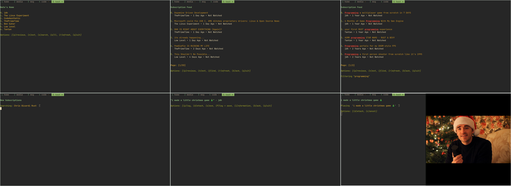

# YT-Feeds


YT-Feeds is a cross-platform simple, fast, and distraction free CLI application to view videos from your favorite channels.



## Features

- Fast startup and navigation 

- Uses minimal resources (under 1 Mb)

- Distraction and short form content free!

- Search for your favorite channels and subscribe/unsubscribe

- Automatically tracks and resumes watch history locally

- Shows recent videos from subscriptions organized by date

- Groups subscriptions into a collective "feed" organized by date

- Categorize and view videos in the 'watch later' menu

- Never requires leaving the terminal or using your mouse  

## Installing

YT-Feeds can be installed via [cargo](https://doc.rust-lang.org/cargo/getting-started/installation.html):
```bash
cargo install --git https://github.com/higgsbi/yt-feeds
```

YT-Feeds requires mpv and yt-dlp to be installed in order to function:
- [mpv](https://github.com/mpv-player/mpv)
- [yt-dlp](https://github.com/yt-dlp/yt-dlp)

For dependency guidance, see the [installation page](docs/00-Installation.md).


## Configuration

For configuration, error logging, and saved data storage, see the [configuration page](docs/01-Configuration.md).

